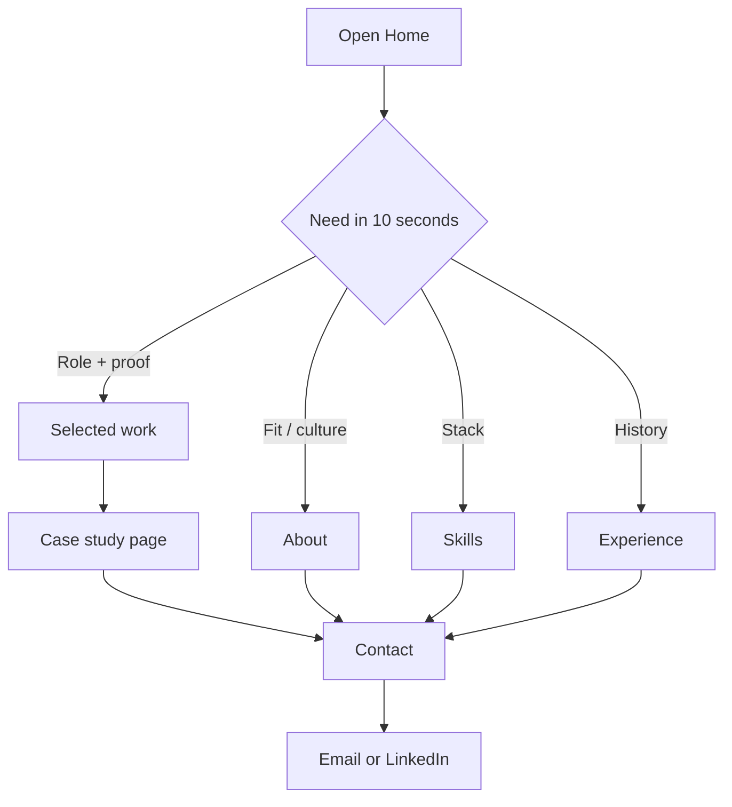
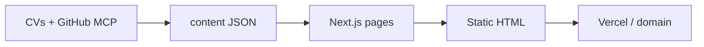
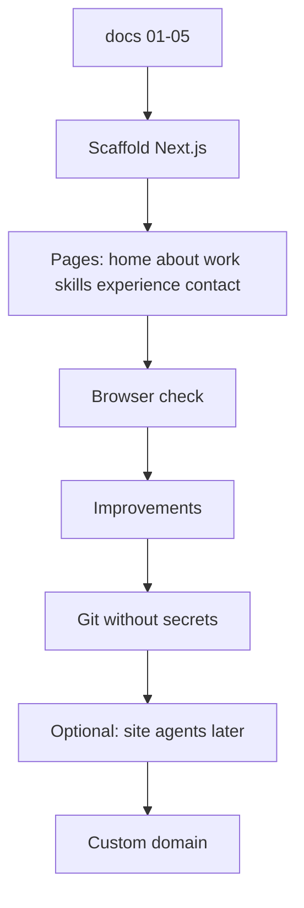

# Workflows

## Visitor path

```mermaid
flowchart TD
  A[Open Home] --> B{Need in 10 seconds}
  B -->|Role + proof| C[Selected work]
  B -->|Fit / culture| D[About]
  B -->|Stack| E[Skills]
  B -->|History| F[Experience]
  C --> G[Case study page]
  G --> H[Contact]
  D --> H
  E --> H
  F --> H
  H --> I[Email or LinkedIn]
```

## Content path (how we keep it true)

```mermaid
flowchart LR
  CV[CVs + GitHub MCP] --> JSON[content JSON]
  JSON --> App[Next.js pages]
  App --> Static[Static HTML]
  Static --> Vercel[Vercel / domain]
```

## Build path (this repo)

```mermaid
flowchart TD
  D1[docs 01-05] --> S[Scaffold Next.js]
  S --> P[Pages: home about work skills experience contact]
  P --> V[Browser check]
  V --> I[Improvements]
  I --> G[Git without secrets]
  G --> AG[Optional: site agents later]
  AG --> DEP[Custom domain]
```
